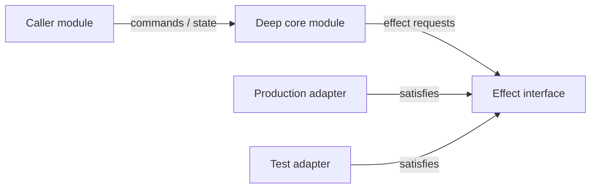

# Architecture: <topic>

## Intent

<Technical outcome, scope, and non-goals.>

## Parent

<Parent spec (PRD) / tracker reference, or state that none exists.>

## Evidence

<Glossary, decision records, supplied requirements, and repository observations.>

## Module map

Include a Mermaid diagram. Use `flowchart` by default to show modules, interfaces, seams, adapters, and dependency direction. Use a Mermaid `sequenceDiagram` or `stateDiagram-v2` instead when lifecycle or transitions are the central design. The diagram complements the written sections; it does not replace them.

## Ownership and interfaces

<For each deep module: responsibility, callers, interface, implementation-hidden behavior, and adapter roles.>

## Flows and invariants

<State, control, and data flow; lifecycle/failure behavior; rules that must remain true.>

## Persistence and rollout

<Persistence, migration, compatibility, rollout, or explicitly state not applicable.>

## Test surface

<Highest useful seams, production/test adapters, and acceptance evidence.>

## Decision status

### Locked

<Decisions an implementer must preserve.>

### Implementation discretion

<Choices intentionally left to the implementer.>

### Decision-record candidates

<Durable decisions to propose separately, or None.>
